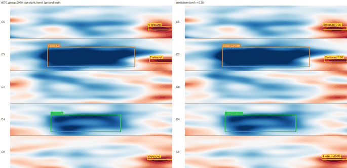
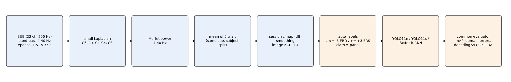
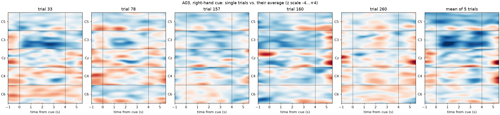
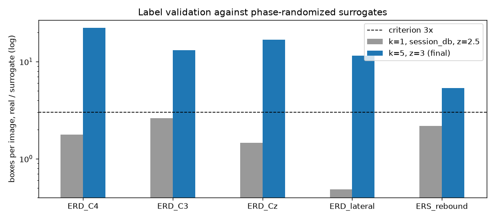

<div align="center">

<h1>Where the Brain Goes Quiet</h1>

<p>Object detection of motor imagery rhythms on EEG spectrograms: YOLO11 and Faster R-CNN find event-related desynchronization (ERD) and beta rebound (ERS) as bounding boxes in channel, time, and frequency, on BCI Competition IV-2a, with automatic labels tested against phase-randomized surrogates.</p>

<p>


</p>

<p>
<a href="#the-method"><b>Method</b></a> ·
<a href="#reproducing"><b>Reproducing</b></a> ·
<a href="#design-notes"><b>Design notes</b></a> ·
<a href="https://github.com/luminolous/quiet-cortex/issues"><b>Report an issue</b></a>
</p>

</div>

<hr>

<p align="center">

</p>
<p align="center"><sub>Ground truth (left) and YOLO11n detections (right) on successive right-hand test groups of one subject. Panels from top to bottom: C5, C3, Cz, C4, C6. Blue marks a power drop, red a power rise.</sub></p>

When you imagine moving your right hand, the mu (8–13 Hz) and beta (13–30 Hz) rhythms over the left motor cortex lose power. Neuroscientists call this event-related desynchronization (ERD). After the imagery ends, beta power often overshoots its baseline, a beta rebound (ERS). On a spectrogram, each event occupies a region with a channel, an onset and offset, and a frequency band, which makes it a bounding box.

This repository treats those events as objects. It stacks the spectrograms of five central electrodes into one 640 × 640 image, generates box labels from z-scored power, trains YOLO11n, YOLO11s, and Faster R-CNN on them, and evaluates every method with one shared evaluator. It also asks two questions that most spectrogram pipelines skip: do automatic labels mark real, cue-locked activity rather than noise, and can the detected boxes decode the imagined movement?

The short answers. Single-trial ERD failed a surrogate test, so each image averages the power of five trials with the same cue; at that level every class beats surrogates by 5–22×. On those images YOLO11n reaches a test mAP@0.5 of 0.927 ± 0.005 over three seeds. As a decoder the boxes fall far behind CSP + LDA, because most groups of tongue and feet imagery contain no ERD at all.

## Contents

- [The method](#the-method)
- [Notebooks](#notebooks)
- [Reproducing](#reproducing)
- [Repository layout](#repository-layout)
- [Design notes](#design-notes)
- [Limitations](#limitations)
- [References](#references)

## The method

<p align="center"></p>

### Data

[BCI Competition IV dataset 2a](https://www.bbci.de/competition/iv/) (Brunner et al., 2008): 9 subjects, 22 EEG channels at 250 Hz, four imagined movements (left hand, right hand, both feet, tongue), 288 trials per session. Session T trains and validates; session E tests, so every test number is cross-session. The session E cue labels come from the [true-label files](https://www.bbci.de/competition/iv/results/). After artifact rejection, 2328 (T) and 2368 (E) trials remain.

### From EEG to an image

1. **Signal.** Drop the EOG channels, band-pass 4–40 Hz (zero-phase FIR), cut epochs from −1.5 to 5.75 s around the cue, and apply a small Laplacian to C5, C3, Cz, C4, and C6.
2. **Power.** Morlet wavelets from 4 to 40 Hz in 1 Hz steps (`n_cycles = f / 2`), cropped to −1.0…5.5 s.
3. **Groups of five trials.** Each image averages the power of 5 trials with the same subject, cue, and split. Train, validation, and test draw from separate trial pools. For every subject and cue we sample 50 / 10 / 50 distinct groups, which gives 1800 / 360 / 1800 images.
4. **z map.** Smooth the power (Gaussian, σ = 2 Hz × 0.4 s), convert it to dB, and z-score every panel and frequency against the pre-cue pixels (−1…0 s) of all groups of the same subject and session.
5. **Image.** Stack the five panels top to bottom (C5, C3, Cz, C4, C6), 640 × 128 pixels each, with time on x and frequency on y (40 Hz at the top of each panel). The colormap `RdBu_r` spans z −4…+4. The image shows the same values the labels come from.

### Labels

The labeler thresholds the same z map: ERD where z ≤ −3 in 8–30 Hz during 0.5–4.0 s, ERS where z ≥ +3 in 13–30 Hz during 4.0–5.5 s. It keeps 4-connected regions that last at least 0.5 s and span at least 2 Hz, and the largest region per panel and type. The panel sets the class:

| ID | Class | Panel | Imagery it points to (decoding experiment) |
|---|---|---|---|
| 0 | `ERD_C4` | C4 | left hand |
| 1 | `ERD_C3` | C3 | right hand |
| 2 | `ERD_Cz` | Cz | feet |
| 3 | `ERD_lateral` | C5, C6 | tongue |
| 4 | `ERS_rebound` | any panel, after 4 s | none |

The labeler never reads the cue. A bilateral ERD gets a box on both panels, and lateralization becomes a question for the decoding experiment.

**Why five trials.** We first labeled single trials. A ±20 % threshold put ERD candidates on 85–97 % of all panels regardless of the cue. A z threshold looked like the fix until we computed it on per-trial baseline-corrected maps: the post-cue spread was 2.4× the baseline spread even in surrogate data, which inflates z. With the corrected session-level z, no class produced 3× more boxes on real data than on phase-randomized surrogates, which keep each epoch's amplitude spectrum and destroy cue-locked events (Theiler et al., 1992). Averaging 5 trials passes the same test for every class:

<p align="center">


</p>

| Setting | ERD_C4 | ERD_C3 | ERD_Cz | ERD_lateral | ERS_rebound | Background (real / surrogate) |
|---|---|---|---|---|---|---|
| Single trial, session z ≥ 2.5 | 1.8× | 2.6× | 1.5× | 0.5× | 2.2× | 62 % / 79 % |
| **5-trial average, z ≥ 3 (final)** | **22.2×** | **13.1×** | **16.7×** | **11.5×** | **5.3×** | 56 % / 94 % |

An AI-assisted review in two passes (Claude Code pre-filled every verdict, a second pass with an AI assistant checked and corrected it) rated 98 boxes in 50 random training images: 82.7 % valid, 14.3 % unsure, and 3.1 % invalid. Hand and midline classes score 94–95 %; `ERD_lateral` (66.7 %) and `ERS_rebound` (68.2 %) are weaker, and the three invalid boxes are broadband end-of-epoch rises that look like muscle artifacts. Box extent matched the visible event for 44 of 98 boxes: the z ≥ 3 rule often marks the strongest core of a larger region.

### Models and training

| Model | Implementation | Weights | Settings |
|---|---|---|---|
| YOLO11n, YOLO11s | Ultralytics 8.4 | COCO | SGD, lr0 1e-2, momentum 0.937, weight decay 5e-4, batch 16, 640 px, 100 epochs, patience 20 |
| Faster R-CNN | torchvision ResNet50-FPN v2 | COCO | SGD, lr 0.005, momentum 0.9, weight decay 1e-4, batch 4, 20 epochs, `min_size = max_size = 640` |

We switch off every augmentation, including the ones Ultralytics enables by default (`fliplr`, `mosaic`, HSV, `translate`, `scale`, `erasing`). A flip reverses time or swaps channels, mosaic mixes panels from different images, and a hue shift changes z values.

### Evaluation

One evaluator (`src/evaluate.py`) reads one prediction format for every method:

- **Detection:** mAP@0.5 and mAP@0.5:0.95 with torchmetrics (COCO IoUs), AP per class, precision, recall, and F1 at confidence 0.25 and IoU 0.5, confusion matrix with background.
- **Domain errors:** onset and offset error (ms), lower and upper frequency error (Hz) of matched boxes.
- **Decoding:** per 5-trial test group, the predicted movement is the ERD class with the highest summed confidence. Groups without an ERD box count as wrong and appear as the no-decision rate. CSP + LDA (8–30 Hz, 0.5–2.5 s, 8 components, per subject) averages its class probabilities over the same five trials.
- **Baselines:** the threshold rule that generates the labels (confidence = mean |z| in the box / 4) and CSP + LDA.

We select models on validation data and report test numbers once.

## Notebooks

Read them in this order. Each one imports from `src/` and ships with its outputs.

| # | Notebook | Content |
|---|---|---|
| 1 | [`dataset_and_erd.ipynb`](notebooks/dataset_and_erd.ipynb) | Raw signal, Laplacian, time-frequency maps, rendering, grand-average ERD/ERS per class |
| 2 | [`annotation.ipynb`](notebooks/annotation.ipynb) | Single-trial diagnosis, surrogate tests, final labels, statistics, AI-assisted quality check |
| 3 | [`results.ipynb`](notebooks/results.ipynb) | E1–E5 tables, training curves, confusion matrices, noise, decoding, per-subject results |
| 4 | [`detection_gallery.ipynb`](notebooks/detection_gallery.ipynb) | Predictions against ground truth, failure cases, tongue imagery, one group under noise, GIFs |

[`results/summary.md`](results/summary.md) lists every reported number with its source table.

## Reproducing

The commands assume the repository root as working directory. Timings come from a laptop with an RTX 4050 (6 GB) and 20 GB RAM.

**1. Environment** (Python 3.12). Install the CUDA build of PyTorch first, then the rest. Leave `albumentations` uninstalled: Ultralytics applies it as augmentation when it finds it.

```bash
python -m venv .venv
.venv/Scripts/python.exe -m pip install torch torchvision --index-url https://download.pytorch.org/whl/cu128
.venv/Scripts/python.exe -m pip install -r requirements.txt
```

On Linux or macOS, use `.venv/bin/python` instead of `.venv/Scripts/python.exe`.

**2. Data.** Download the 18 GDF files and the 18 true-label `.mat` files and place them here:

```
dataset/raw/BCICIV_2a_gdf/A01T.gdf … A09E.gdf
dataset/raw/true_labels/A01T.mat … A09E.mat
```

**3. Preprocessing, labels, datasets.**

| Step | Command | Time |
|---|---|---|
| Preprocess all files, grand averages | `python -m src.data` | 3 min |
| Train/val split, single-trial labels and statistics | `python -m src.autolabel` | 8 min |
| Single-trial rule variants (optional) | `python -m src.autolabel --diagnose configs/autolabel_variants.yaml` | 10 min |
| Single-trial surrogate test (optional) | `python -m src.autolabel --null-test configs/autolabel_null.yaml` | 5 min |
| 5-trial surrogate test | `python -m src.groups --null-test` | 7 min |
| k × z surrogate grid (optional) | `python -m src.groups --config configs/groups_null_grid.yaml --null-test` | 15 min |
| Build the YOLO datasets and QC overlays | `python -m src.groups --build` | 11 min |
| Noisy test sets for E4 | `python -m src.groups --noise-snr 30 20 15 10 5 0` | 36 min |

**4. Training** (about 7 h for all 11 runs). Pick the script for your shell:

```bash
bash scripts/train_all.sh
```

```bash
powershell -ExecutionPolicy Bypass -File scripts/train_all.ps1
```

A single run: `python -m src.train --config configs/experiments/e1_baseline.yaml`. Add `--smoke` for a one-epoch check on a small subset.

**5. Evaluation and tables** (about 30 min): `bash scripts/evaluate_all.sh` or `scripts/evaluate_all.ps1`. The script predicts with every model, evaluates validation and test, runs both baselines, and writes the tables in `results/tables/`.

**6. Tests and notebooks.**

```bash
.venv/Scripts/python.exe -m pytest -q tests
.venv/Scripts/python.exe -m jupyter nbconvert --to notebook --execute --inplace notebooks/results.ipynb
```

Random seeds are fixed (splits, groups, surrogates, noise, training seed 0; seed runs 1 and 2).

## Repository layout

```
quiet-cortex/
├── src/
│   ├── data.py            GDF loading, preprocessing, time-frequency maps, rendering, noise
│   ├── autolabel.py       labeling rule, split, single-trial diagnostics and surrogate test
│   ├── groups.py          5-trial groups, z maps, YOLO datasets, surrogate test, noisy test sets
│   ├── train.py           YOLO11 and Faster R-CNN training
│   ├── baselines.py       threshold detector, CSP + LDA
│   ├── evaluate.py        common evaluator, decoding, experiment tables
│   └── utils/             coordinates, config and seeding, figures
├── configs/               preprocessing, labeling, groups, data YAMLs, one YAML per experiment run
├── scripts/               train_all and evaluate_all (sh and ps1)
├── notebooks/             the four notebooks above
├── tests/                 coordinate mapping, labeling, groups, evaluator
├── results/
│   ├── tables/            every reported number (CSV)
│   ├── figures/           figures and GIFs
│   ├── qc/                review overlays and verdict sheet
│   └── summary.md
└── dataset/               raw, processed, and YOLO data (not tracked)
```

Coordinates follow one mapping, tested in `tests/test_coords.py`:

```
x(t)    = (t + 1.0) / 6.5 × 640                    t in seconds after the cue
y(p, f) = p × 128 + (1 − (f − 4) / 36) × 128       p = panel index (C5 = 0 … C6 = 4), f in Hz
```

## Design notes

Problems we hit, and what the code does about them.

- **Ultralytics validation pads square images.** Its validator builds a rectangular-batch dataset that pads 640 × 640 images to 672 × 672 with grey borders. Events at the image edge suffer most: the first YOLO11n run read 0.823 mAP@0.5 in Ultralytics' validation and 0.969 in ours, with `ERS_rebound` at 0.46 against 0.96. `src/train.py` passes a trainer that validates on unpadded images, so early stopping and `best.pt` follow the right metric.
- **Ultralytics predicts a Python list as one batch.** `model.predict(list_of_paths)` ignores `batch` and ran out of GPU memory on 1800 images. `src/evaluate.py` feeds chunks of 16.
- **Default augmentations go beyond the usual list.** Ultralytics 8.4 also enables random erasing (`erasing = 0.4`); the training code sets every augmentation parameter to zero and the run's `args.yaml` records it.
- **Per-trial baselines inflate z.** z-scoring a map that was already normalized to each trial's own baseline underestimates the baseline variance. The labels z-score absolute dB power against the pooled baseline of a session.
- **Location-defined classes need position.** One-stage detectors keep the panels apart; Faster R-CNN mixes them up, possibly because its RoI classifier loses absolute position (untested).
- **Smoke runs stay out of the tables.** Any run named `smoke_*` skips the result tables.

## Limitations

- Automatic labels: `ERD_lateral` and `ERS_rebound` are the least reliable classes, some ERS boxes mark artifacts, and box extent often covers the core of a visible event and misses its edges.
- Position fixes the class, so the detectors face no real classification problem; they find events and their extent.
- The threshold rule generates the labels, so its clean score is a ceiling and not a fair competitor.
- Validation holds 360 images whose groups share 38.7 % of their trials on average. Seed 0, the selected run, was the best of three seeds on validation.
- The ± over three seeds reflects training randomness alone: every seed sees the same groups, and test groups share 7.7 % of their trials on average, so the spread says nothing about variation across data.
- The quality check is AI-assisted (two passes, recorded in `results/qc/qc_sheet.csv`); no expert rated the boxes by hand.
- Decoding works on groups of five trials and does not measure single-trial BCI performance.
- Subjects with weak sensorimotor modulation (A02, A04, A05) contribute few or no ERD events.

## References

1. Brunner, C., Leeb, R., Müller-Putz, G. R., Schlögl, A., & Pfurtscheller, G. (2008). *BCI Competition 2008 – Graz data set A*. Graz University of Technology.
2. Pfurtscheller, G., & Lopes da Silva, F. H. (1999). Event-related EEG/MEG synchronization and desynchronization: basic principles. *Clinical Neurophysiology*, 110(11), 1842–1857.
3. Ramoser, H., Müller-Gerking, J., & Pfurtscheller, G. (2000). Optimal spatial filtering of single trial EEG during imagined hand movement. *IEEE Transactions on Rehabilitation Engineering*, 8(4), 441–446.
4. Theiler, J., Eubank, S., Longtin, A., Galdrikian, B., & Farmer, J. D. (1992). Testing for nonlinearity in time series: the method of surrogate data. *Physica D*, 58(1–4), 77–94.
5. Ren, S., He, K., Girshick, R., & Sun, J. (2015). Faster R-CNN: Towards real-time object detection with region proposal networks. *NeurIPS*.
6. Jocher, G., & Qiu, J. (2024). *Ultralytics YOLO11*. https://github.com/ultralytics/ultralytics
7. Gramfort, A., et al. (2013). MEG and EEG data analysis with MNE-Python. *Frontiers in Neuroscience*, 7, 267.

## License

[MIT](LICENSE).
